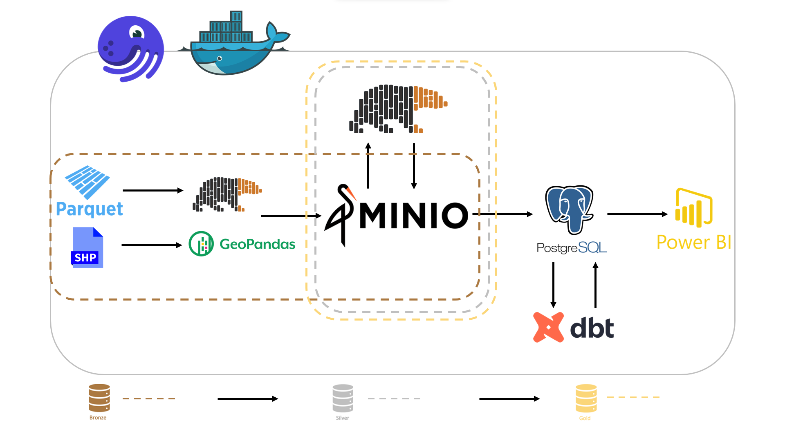
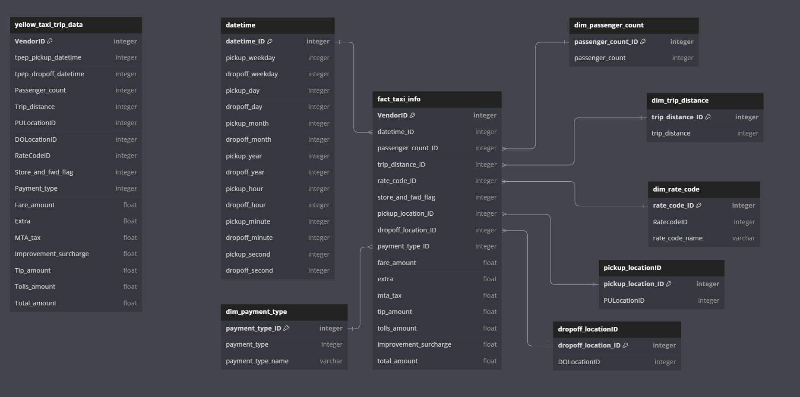
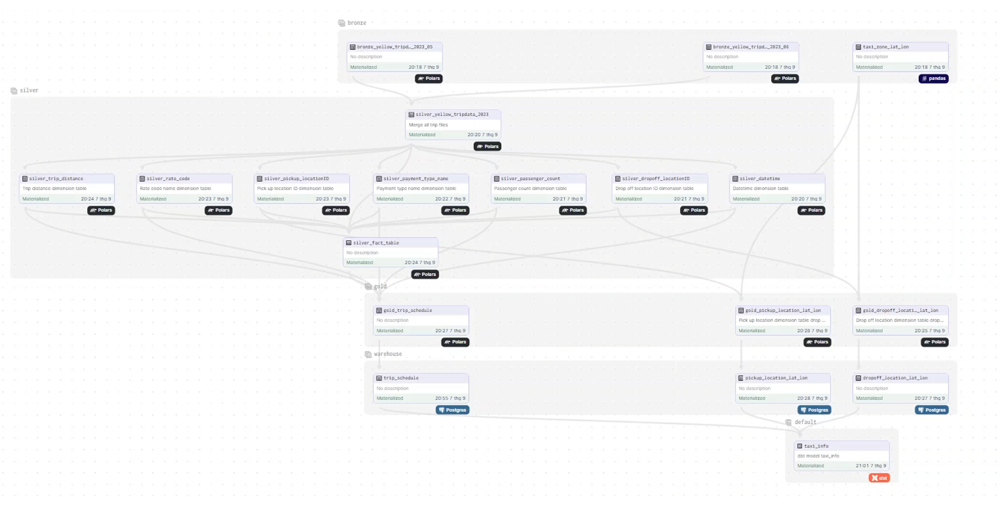
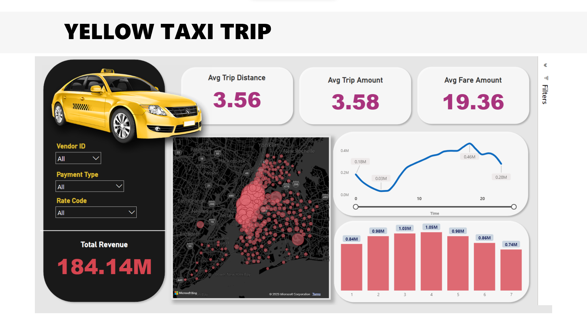

# YELLOW TAXI TRIP
## _New York City (NYC)_


## I. Introduce
### 1. The goal of this project
The purpose of this paper was to demonstrate the process of implementing ETL (Extract, Transform, Load) on Yellow Taxi Trip Data in New York City (NYC). The report's objectives are as follows:
 - The NYC Yellow Taxi data source is presented in detail.
 - Explain the ETL procedure used to extract, transform, and load data into the system.
 - Displays findings and preprocessed data for later analysis and reporting.

### 2. Data sources
NYC Yellow Taxi trip data has been collected from official NYC data sources. This data includes fields capturing pick-up and drop-off dates/times, pick-up and drop-off locations, trip distances, itemized fares, rate types, payment types, and driver-reported passenger counts.

The dataset used 
  - 2 months (May - June / 2023) - https://github.com/vsonwork/yellow-taxi-trip-ETL/tree/main/yellow_taxis_dataset
  - Taxi Zone Shapefile - https://d37ci6vzurychx.cloudfront.net/misc/taxi_zones.zip

> **TLC Trip Record Data:**
> 
> Link website: https://www.nyc.gov/site/tlc/about/tlc-trip-record-data.page
> 
> Data Dictionary: https://www.nyc.gov/assets/tlc/downloads/pdf/data_dictionary_trip_records_yellow.pdf

## II. Architecture



#### 1. Containerize the application with `Docker` and orchestrate assets with `Dagster`.

#### 2. Bronze layer
  - Yellow Taxi Data is obtained in `.parquet` format from **TLC Trip Record Data** before being read by `Polars` and loaded into the `MinIO`.
  - Using the `GeoPandas` and `PyProj` libraries, convert data from a `shapefile` to a `DataFrame` by performing coordinate conversions from one coordinate system to another, then extract the table-formatted data above using Polars.
    
    ```Python
    shapefile_path = f"{adr_data}/{zone_data}/{zone_data}.shp"

    gdf = gpd.read_file(shapefile_path)
    # Define
    source_crs = gdf.crs  # CRS of the shapefile
    target_crs = 'EPSG:4326'  # WGS84 - lat/lon CRS

    # Create a PyProj transformer
    transformer = pyproj.Transformer.from_crs(source_crs, target_crs, always_xy=True)

    gdf['longitude'] = gdf.geometry.centroid.x
    gdf['latitude'] = gdf.geometry.centroid.y
    gdf['longitude'], gdf['latitude'] = transformer.transform(gdf['longitude'], gdf['latitude'])

    df = pl.DataFrame(gdf[['LocationID', 'longitude', 'latitude']])
    ```
    
#### 3. Silver layer:
  - Load data from MinIO into `Polars` to split schema in order to create data modeling.
  - Convert the `Polars` DataFrame to `.parquet` and then import it into `MinIO`.
    
    
    
#### 4. Gold layer:
  - Load data from MinIO into `Polars` to convert the raw to gold.
  - Convert the `Polars` DataFrame to `.parquet` and then import it into `MinIO`.

#### 5. Using `Postgres` and `dbt`, transform as necessary.

#### 6. Utilize `Power BI` to visualize the data.

## III. Data Lineage



## IV. Result - Visualize


